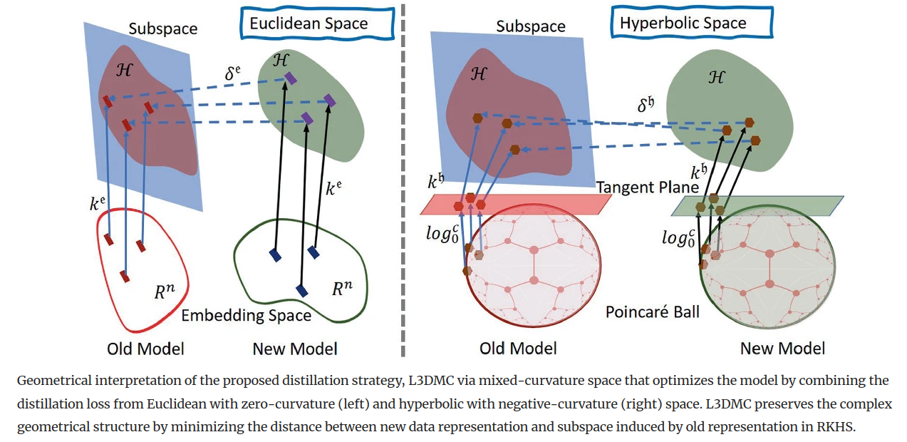

# L3DMC: Lifelong Learning using Distillation via Mixed-Curvature Space

<p align="center" style="text-align: center;">
    
    Code for <a style='ext-align: center;' href="https://link.springer.com/chapter/10.1007/978-3-031-43895-0_12">L3DMC: Lifelong Learning using Distillation via Mixed-Curvature Space</a>.
</p>


# Abstract
The performance of a lifelong learning (L3) model degrades when it is trained on a series of tasks, as the geometrical formation of the embedding space changes while learning novel concepts sequentially. The majority of existing L3 approaches operate on a fixed-curvature (e.g., zero-curvature Euclidean) space that is not necessarily suitable for modeling the complex geometric structure of data. Furthermore, the distillation strategies apply constraints directly on low-dimensional embeddings, discouraging the L3 model from learning new concepts by making the model highly stable. To address the problem, we propose a distillation strategy named L3DMC that operates on mixed-curvature spaces to preserve the already-learned knowledge by modeling and maintaining complex geometrical structures. We propose to embed the projected low dimensional embedding of fixed-curvature spaces (Euclidean and hyperbolic) to higher-dimensional Reproducing Kernel Hilbert Space (RKHS) using a positive-definite kernel function to attain rich representation. Afterward, we optimize the L3 model by minimizing the discrepancies between the new sample representation and the subspace constructed using the old representation in RKHS. L3DMC is capable of adapting new knowledge better without forgetting old knowledge as it combines the representation power of multiple fixed-curvature spaces and is performed on higher-dimensional RKHS. Thorough experiments on three benchmarks demonstrate the effectiveness of our proposed distillation strategy for medical image classification in L3 settings. 


# Repository Contributions

This repository contains the implementation of the paper 'L3DMC: Lifelong Learning using Distillation via Mixed-Curvature Space'. 

If you find this code useful, please reference in our paper:

```
@inproceedings{roy2023l3dmc,
  title={L3DMC: Lifelong Learning using Distillation via Mixed-Curvature Space},
  author={Roy, Kaushik and Moghadam, Peyman and Harandi, Mehrtash},
  booktitle={International Conference on Medical Image Computing and Computer-Assisted Intervention},
  pages={123--133},
  year={2023},
  organization={Springer}
}
```

# Getting Started

L3DMC is an end-to-end training strategy for continual learning model trained on a series of novel datasets. Please follow the instructions outlined below.


Run the code using following command:
```
python3 -u main_incremental.py
```

followed by general options:

* `--gpu`: index of GPU to run the experiment on (default=0)
* `--results-path`: path where results are stored (default='../results')
* `--exp-name`: experiment name (default=None)
* `--seed`: random seed (default=0)
* `--save-models`: save trained models (default=False)
* `--last-layer-analysis`: plot last layer analysis (default=False)
* `--no-cudnn-deterministic`: disable CUDNN deterministic (default=False)

and specific options for each of the code parts:
  
* `--approach`: learning approach used (default='l3dmc') 
* `--datasets`: dataset or datasets used (default=['bloodmnist'])
* `--network`: network architecture used (default='resnet32')
* `--log`: loggers used (default='disk')

* `--alpha`: Weight for KD loss
* `--beta`: Weight for Mixed Curvature Feature Distillation loss

# Acknowledgement
We would like to acknowledge the authors of [LifeLonger: A Benchmark for Continual Disease Classification](https://github.com/mmderakhshani/LifeLonger) for their excellent codebase which has been used as a starting point for this project.
